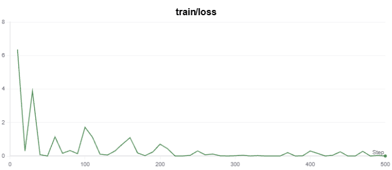

# QWEN2.5-1.5B-Instruct 微调项目

## 1. 项目介绍

本项目基于 **QWEN2.5-1.5B-Instruct** 进行 **文本分类** 和 **命名实体识别（NER）** 任务的微调。

- **文本分类**：对新闻文本进行分类。
- **命名实体识别（NER）**：识别文本中的命名实体。

本项目支持 **Jupyter Notebook 训练**（合并代码）和 **Python 脚本运行**（分开代码）。

## 2. 环境准备

### 2.1 安装 Python 依赖

```bash
conda create -n qwen_finetune python=3.10 -y
conda activate qwen_finetune

pip install torch transformers datasets peft accelerate deepspeed tqdm pandas scikit-learn modelscope
```

### 2.2 下载 QWEN2.5-1.5B-Instruct 预训练模型

```bash
modelscope download --model Qwen/Qwen2.5-1.5B-Instruct --local_dir ./qwen/Qwen2.5-1.5B-Instruct
```

### 2.3 Swanlab连接

如果是第一次使用[SwanLab](https://swanlab.cn/)，则前往SwanLab注册账号后，在用户设置复制API Key，然后在命令行执行下面的命令，会要求你输入你的API Key完成验证：

```bash
swanlab login
```

设置完Swanlab即可在Swanlab平台上观察每个项目的训练过程和结果。

## 3. 目录结构

```css
chinese-llm-sft/
├── data/                          # 数据存放目录
│   ├── chinese_ner_sft/            # 命名实体识别数据
│   ├── zh_cls_fudan-news/          # 文本分类数据
│
├── imgs/                          # 训练过程中的损失曲线
│   ├── classification_loss.png      # 文本分类损失
│   ├── ner_loss.png                 # NER 任务损失
│
├── output/                        # 训练输出目录
│   ├── Qwen2/                       # 分类任务的输出
│   ├── Qwen2.5-NER/                  # NER 任务的输出
|
├── qwen/
|	├── Qwen2.5-1.5B-Instruct/  # 预训练好的Qwen2.5-Instruct模型
│
├── swanlog/                        # 训练日志存放
│   ├── run-20250228_105301/         # 训练日志 1
│   ├── run-20250228_110108/         # 训练日志 2
│   ├── run-20250228_110331/         # 训练日志 3
│   ├── run-20250228_155429/         # 训练日志 4
│
├── qwen_classification.ipynb       # Notebook 代码（文本分类 + NER 任务）
├── qwen_ner.ipynb                  # Notebook 代码（NER 任务）
├── train_qwen2_classification.py    # 文本分类任务训练脚本
├── train_qwen2_ner.py               # NER 任务训练脚本
├── transfer_classification_data.py  # 文本分类数据预处理
├── transfer_ner_data.py             # NER 数据预处理
├── requirements.txt                 # 依赖库列表
├── readme.md                        # 本文档
```

## 4. 数据预处理

### 4.1 文本分类数据

文本分类任务-数据集下载：在[huangjintao/zh_cls_fudan-news](https://modelscope.cn/datasets/swift/zh_cls_fudan-news/files)下载train.jsonl和test.jsonl到根目录下的data文件夹中

```shell
modelscope download --dataset swift/zh_cls_fudan-news --local_dir ./data
```

接下来需要将原始数据转化成符合训练要求的格式：

```shell
python transfer_classification_data.py
```

### 4.2 命名实体识别(NER)数据

命名实体识别任务-数据集下载：在[qgyd2021/chinese_ner_sft](https://huggingface.co/datasets/qgyd2021/chinese_ner_sft)下载ccfbdci.jsonl到根目录下的data文件夹中

该数据集包含LOC（地点）、GPE（地理）、ORG（组织）和PER（人名）四种实体类型标注，每条数据的例子如下：

```json
{
  "text": "今天亚太经合组织第十二届部长级会议在这里开幕，中国外交部部长唐家璇、外经贸部部长石广生出席了会议。",
  "entities": [
    {
        "start_idx": 23,
        "end_idx": 25,
        "entity_text": "中国",
        "entity_label": "GPE",
        "entity_names": ["地缘政治实体", "政治实体", "地理实体", "社会实体"]},
        {
            "start_idx": 25,
            "end_idx": 28,
            "entity_text": "外交部",
            "entity_label": "ORG",
            "entity_names": ["组织", "团体", "机构"]
        },
        {
            "start_idx": 30,
            "end_idx": 33,
            "entity_text": "唐家璇",
            "entity_label": "PER",
            "entity_names": ["人名", "姓名"]
        }, 
        ...
    ],
"data_source": "CCFBDCI"
}
```

其中``text``是输入的文本，``entities``是文本抽取出的实体。我们的目标是希望微调后的大模型能够根据由``text``组成的提示词，预测出一个json格式的实体信息：

```text
输入：今天亚太经合组织第十二届部长级会议在这里开幕，中国外交部部长唐家璇、外经贸部部长石广生出席了会议。

大模型输出：{"entity_text":"中国", "entity_label":"组织"}{"entity_text":"唐家璇", "entity_label":"人名"}...
```

## 5. 训练模型

### 5.1 训练文本分类模型

```shell
python train_qwen2_classification.py --train_file data/train_cls.jsonl --output_dir output/Qwen2
```

在SwanLab上可以看到训练的loss变化



### 5.2 训练 NER 模型

```shell
python train_qwen2_ner.py --train_file data/train_ner.jsonl --output_dir output/Qwen2.5-NER
```

在SwanLab上可以看到训练的loss变化


## 6. 模型结果

### 6.1 文本分类结果

以测试集的前10条为例，预测结果如下：

```css
Computer
Military
Politics
文章类型:教育
History
Space
Transport
Literature
Economy
Art
```

### 6.2 命名实体识别结果

```css
{'role': 'user', 'content': '文本:最近１０个星期的以巴严重冲突已经造成了３００多人丧生，其中大部分是巴勒斯坦人。'}
{'role': 'assistant', 'content': '{"entity_text":"以巴","entity_label":"地理实体"}'}

{'role': 'user', 'content': '文本:戒备森严的菲律宾参议院７号在２０员议员到场的情况之下主席宣布正式开庭。'}
{'role': 'assistant', 'content': '{"entity_text":"菲律宾","entity_label":"地理实体"}'}

{'rol': 'user', 'content': '文本:在李前总统开刀的消息方面。'}
{'role': 'assistant', 'content': '{"entity_text": "李前", "entity_label": "人名"}'}
```

